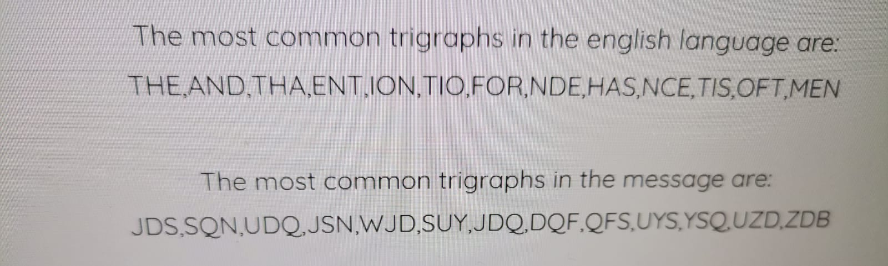

#LEVEL0->1
#Parola o obtin prin decodificarea in baza 64 a stringului dat
:
caran_raluca@caran:~/Krypton$ echo "S1JZUFRPTklTR1JFQVQ=" | base64 -d
KRYPTONISGREAT

#LEVEL1->2
krypton1@krypton:/krypton$ ls /krypton/krypton1
krypton2  README
krypton1@krypton:/krypton/krypton1$ cat krypton2
YRIRY GJB CNFFJBEQ EBGGRA
#Folosesc schema de la cifrul ROT13.
krypton1@krypton:/krypton/krypton1$ tr "[a-zA-Z]" "[n-za-mN-ZA-M]" < krypton2
LEVEL TWO PASSWORD ROTTEN

#LEVEL2->3
krypton2@krypton:~$ cd /krypton/krypton2
krypton2@krypton:/krypton/krypton2$ ls -al
total 32
drwxr-xr-x 2 root     root     4096 May 19  2020 .
drwxr-xr-x 8 root     root     4096 May 19  2020 ..
-rwsr-x--- 1 krypton3 krypton2 9032 May 19  2020 encrypt
-rw-r----- 1 krypton3 krypton3   27 May 19  2020 keyfile.dat
-rw-r----- 1 krypton2 krypton2   13 May 19  2020 krypton3
-rw-r----- 1 krypton2 krypton2 1815 May 19  2020 README
krypton2@krypton:/krypton/krypton2$ cat krypton3
OMQEMDUEQMEK
krypton2@krypton:/krypton/krypton2$ ./encrypt

 usage: encrypt foo  - where foo is the file containing the plaintext
#Creez un director in /tmp/ unde creez un link catre keyfile. Trebuie sa aflu ce fel de codificare a fost utilizata.
krypton2@krypton:/krypton/krypton2$ ./encrypt keyfile.dat
failed to create cipher file 
krypton2@krypton:/krypton/krypton2$ mktemp -d
/tmp/tmp.i78Y8RZDJP
krypton2@krypton:/krypton/krypton2$ cd /tmp/tmp.i78Y8RZDJP
krypton2@krypton:/tmp/tmp.i78Y8RZDJP$ ln -s /krypton/krypton2/keyfile.dat
krypton2@krypton:/tmp/tmp.i78Y8RZDJP$ ls
keyfile.dat
krypton2@krypton:/tmp/tmp.i78Y8RZDJP$ chmod 777 .
#Criptam continutul fisierului /etc/issue, cum este in exemplu.
krypton2@krypton:/tmp/tmp.i78Y8RZDJP$ /krypton/krypton2/encrypt /etc/issue
krypton2@krypton:/tmp/tmp.i78Y8RZDJP$ ls
ciphertext  keyfile.dat
krypton2@krypton:/tmp/krypton2$ cat ciphertext
PQHGMZSZGXUZGJMEOUUZX
#Nu am inteles cum are loc criptarea, asa ca voi crea un fisier cu urmatorul continut "ABCabc" si il voi cripta.
krypton2@krypton:/tmp/krypton2$ /krypton/krypton2/encrypt plaintext
krypton2@krypton:/tmp/krypton2$ cat ciphertext
MNOMNO
krypton2@krypton:/tmp/krypton2$ cat /krypton/krypton2/krypton3 | tr "M-ZA-LM-ZA-L" "a-zA-Z"
CAESARISEASY

#LEVEL3->4
caranraluca@caran:~/Krypton$ ssh krypton3@krypton.labs.overthewire.org -p 2231
krypton3@krypton:/krypton$ ls 
krypton1  krypton2  krypton3  krypton4  krypton5  krypton6
krypton3@krypton:/krypton$ cd /krypton/krypton3
krypton3@krypton:/krypton/krypton3$ ls -la
total 36
drwxr-xr-x 2 root     root     4096 May 19  2020 .
drwxr-xr-x 8 root     root     4096 May 19  2020 ..
-rw-r----- 1 krypton3 krypton3 1542 May 19  2020 found1
-rw-r----- 1 krypton3 krypton3 2128 May 19  2020 found2
-rw-r----- 1 krypton3 krypton3  560 May 19  2020 found3
-rw-r----- 1 krypton3 krypton3   56 May 19  2020 HINT1
-rw-r----- 1 krypton3 krypton3   37 May 19  2020 HINT2
-rw-r----- 1 krypton3 krypton3   42 May 19  2020 krypton4
-rw-r----- 1 krypton3 krypton3  785 May 19  2020 README
#Am afisat continutul fiecarui fisier. Sunt puse la dispozitie si niste hinturi:
krypton3@krypton:/krypton/krypton3$ cat HINT1
Some letters are more prevalent in English than others.
krypton3@krypton:/krypton/krypton3$ cat HINT2
"Frequency Analysis" is your friend
#Trebuie sa analizez frecventa de aparitie a literelor in cele 3 fisiere found. Am gasit urmatorul site care mi-a venit in ajutor: https://crypto.interactive-maths.com/frequency-analysis-breaking-the-code.html. In functie de frecventa literelor in limba engleza , am asociat literele in ordinea inversa a frecventelor din cele 3 texte, precum si frecventa grupurilor de 2 ,respectiv 3 litere.

 

tr "S" "E"
tr "R" "Q"
tr "JDS" "THE" 
tr "SQN" "AND"

KSVVW BGSJD SVSIS VXBMN YQUUK BNWCU ANMJS

KEVVW BGE THE VEIE VXBMN YQUUK BNWCU ANMTE 

KEVVW BGE THE VEVE VXBMN YQUUK BNWCU ANMTE 

KELL WBGE THE LEVEL XBMN YQUUK BNWCU ANMTE 

WELL WBGE THE LEVEL XBMN YQUUW BNWCU ANMTE

WELL DONE THE LEVEL XOMN YQUUW ONDCU ANMTE

WELL DONE THE LEVEL FO MN YQUU WO N D CU ANM TE 

WELL DONE THE LEVEL FO MN YQ SSWO N D C S ANM TE 

WELL DONE THE LEVEL FO MN PASSWO N D C S ANM TE

WELL DONE THE LEVEL FO MR PASSWORD C S ANM TE

WELL DONE THE LEVEL FOUR PASSWORD C S A  RUTE

WELL DONE THE LEVEL FOUR PASSWORD IS  ARUTE

cat krypton4| tr "JDSRIVKWBGXUYQNMC" "THEQVLWDONFSPARUI"

#Nu am decofificat litera A insa incerc parola "ARUTE". Nu e corecta. Incerc "BRUTE". Parola corecta este BRUTE.

#LEVEL4->5
caranraluca@caran: ssh krypton4@krypton.labs.overthewire.org -p 2231
krypton4@krypton: cd /krypton/krypton4
krypton4@krypton:/krypton/krypton4$ ls -al
total 28
drwxr-xr-x 2 root     root     4096 May 19  2020 .
drwxr-xr-x 8 root     root     4096 May 19  2020 ..
-rw-r----- 1 krypton4 krypton4 1740 May 19  2020 found1
-rw-r----- 1 krypton4 krypton4 2943 May 19  2020 found2
-rw-r----- 1 krypton4 krypton4  287 May 19  2020 HINT
-rw-r----- 1 krypton4 krypton4   10 May 19  2020 krypton5
-rw-r----- 1 krypton4 krypton4 1385 May 19  2020 README
#Pentru a afla cheia folosita , am folosit urmatorul site https://www.dcode.fr/vigenere-cipher, unde am copiat continutul celor 2 fisiere found1 si found2 si am completat campul corespunzator lungimii cheii. Prima cheie sugerata este : FREKEY
krypton4@krypton:/krypton/krypton4$ cat krypton5
HCIKV RJOX
#Am introdus CIPHERTEXT-ul si cheia. Mi-a fost generat plaintextul : CLEAR TEXT. 

#LEVEL5->6
caranraluca@caran: ssh krypton5@krypton.labs.overthewire.org -p 2231    - cu parola:CLEARTEXT
krypton5@krypton:~$ cd /krypton/krypton5
krypton5@krypton:/krypton/krypton5$ ls -a
.  ..  found1  found2  found3  krypton6  README
#Pentru a afla cheia folosita , am folosit urmatorul site https://www.dcode.fr/vigenere-cipher, unde am copiat continutul celor 3 fisiere found1,found2 si found3. Neavand nicio informatie despre cheie am folosit Kasiski test. Prima cheie sugerata este : KEYLENGHT.Am copiat continutul fisierului krypton6 si am introdus cheia folosita. Parola obtinuta este: RANDOM.

#LEVEL6->7
caranraluca@caran: ssh krypton6@krypton.labs.overthewire.org -p 2231 - cu parola RANDOM
krypton6@krypton:~$ cd /krypton/krypton6
krypton6@krypton:/krypton/krypton6$ ls -al
total 52
drwxr-xr-x 3 root     root      4096 May 19  2020 .
drwxr-xr-x 8 root     root      4096 May 19  2020 ..
-rwsr-x--- 1 krypton7 krypton6 13344 May 19  2020 encrypt6
-rw-r----- 1 krypton6 krypton6   164 May 19  2020 HINT1
-rw-r----- 1 krypton6 krypton6    11 May 19  2020 HINT2
-rw-r----- 1 krypton7 krypton7    11 May 19  2020 keyfile.dat
-rw-r----- 1 krypton6 krypton6    15 May 19  2020 krypton7
drwxr-xr-x 2 root     root      4096 May 19  2020 onetime
-rw-r----- 1 krypton6 krypton6  4342 May 19  2020 README
krypton6@krypton:/krypton/krypton6$ cat HINT1
The 'random' generator has a limited number of bits, and is periodic.
Entropy analysis and a good look at the bytes in a hex editor will help.

There is a pattern!
krypton6@krypton:/krypton/krypton6$ cat HINT2
8 bit LFSR
#LSFR-Linear Feedback Shift Register
#Nu am acces la keyfile.dat. Creez un director in /tmp/ in care creez un link catre keyfile.dat si ofer directorului permisiuni de r,w,x pentru toti utilizatorii.
krypton6@krypton:/krypton/krypton6$ mkdir /tmp/carank6
krypton6@krypton:/krypton/krypton6$ cd /tmp/carank6
krypton6@krypton:/tmp/carank6$ ln -s /krypton/krypton6/keyfile.dat
krypton6@krypton:/tmp/carank6$ ls
keyfile.dat
krypton6@krypton:/tmp/carank6$ chmod 777 .
